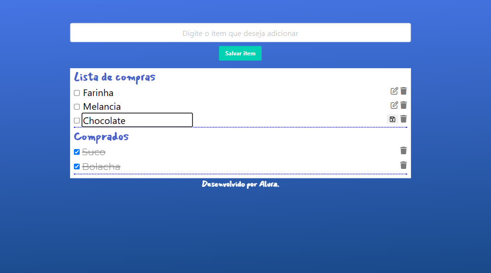

# Lista de Compras 🛒

Projeto de uma lista de compras funcional e interativa, que permite adicionar, editar, marcar como comprado, deletar e salvar itens localmente no navegador.

> Este projeto foi desenvolvido como parte do curso **"JavaScript: manipulando objetos"** da [Alura](https://www.alura.com.br/). A estrutura HTML e o estilo CSS foram fornecidos, e o foco do curso foi a construção de toda a lógica e interatividade da aplicação com JavaScript.

  

## ✨ Funcionalidades JavaScript

Principais funcionalidades implementadas:

### 1. Adição e Validação de Itens 🗒️
Permite que o usuário adicione novos itens à lista, impedindo a inclusão de duplicatas.

-   **`form.addEventListener('submit', callback)`**: Escuta o evento de envio do formulário. A função `callback` é executada, impedindo o recarregamento padrão da página e chamando a lógica para salvar o item.
-   **`listaDeItens.some()`**: Antes de adicionar um novo item, este método percorre o array `listaDeItens` e retorna `true` se encontrar algum elemento que satisfaça a condição (neste caso, se um item com o mesmo nome já existe). É a base da validação contra duplicatas.
-   **`listaDeItens.push()`**: Se o item não for duplicado, este método adiciona um novo objeto (ex: `{ valor: "Maçã", checar: false }`) ao final do array `listaDeItens`, que serve como o estado central da aplicação.

### 2. Renderização Dinâmica da Lista 💻
Exibe os itens na tela, separando-os entre "Lista de compras" e "Comprados" com base em seu estado.

-   **`element.innerHTML = ""`**: Antes de renderizar os itens, esta propriedade é usada para limpar o conteúdo HTML das listas `<ul>`. Isso evita que os itens sejam duplicados visualmente a cada atualização da tela.
-   **`listaDeItens.forEach()`**: Itera sobre cada objeto do array `listaDeItens`, permitindo que o código crie um elemento `<li>` para cada item de compra.
-   **`Template Literals` (`` `...` ``)**: Utilizadas para construir a string HTML de cada item de forma dinâmica e legível, inserindo valores do JavaScript (como `elemento.valor` e o `index`) diretamente no HTML.

### 3. Marcar Itens como Comprados ✅
Muda o estado de um item (e o move de lista) quando o usuário clica na caixa de seleção.

-   **`parentElement.getAttribute('data-value')`**: Quando um checkbox é clicado, este método é usado para ler o valor do atributo `data-value` do elemento `<li>` pai. Esse valor corresponde ao índice do item no array `listaDeItens`, identificando qual item deve ser modificado.
-   **`evento.target.checked`**: Esta propriedade do evento de clique retorna o estado atual do checkbox: `true` se ele foi marcado, e `false` se foi desmarcado. O valor é usado para atualizar diretamente a propriedade `checar` do item no array.

### 4. Editar Itens ✏️
Permite ao usuário alterar o nome de um item diretamente na lista.

-   **Variável `itemAEditar`**: Atua como um "sinalizador" de estado. Quando o usuário clica para editar, o índice do item é armazenado nesta variável. Se o valor for diferente de `-1`, a aplicação sabe que está em "modo de edição".
-   **Operador Ternário (`condição ? valor_se_true : valor_se_false`)**: Usado durante a renderização para criar uma interface condicional. Ele verifica se o índice do item atual é o mesmo de `itemAEditar` para decidir se deve mostrar um campo de texto editável (`<input>`) e um botão de salvar, ou um texto fixo e um botão de editar.

### 5. Deletar Itens 🗑️
Remove permanentemente um item da lista ao clicar no ícone da lixeira.

-   **`listaDeItens.splice(indice, 1)`**: Este é o método central para a exclusão. Ele modifica diretamente o array `listaDeItens`, removendo `1` elemento a partir da posição especificada pelo `indice`. Após a remoção, a lista é renderizada novamente para refletir a mudança.

### 6. Persistência de Dados com Local Storage 💾
Salva a lista de compras no navegador, de forma que os itens não se percam se a página for fechada ou recarregada.

-   **`localStorage.setItem()`**: Armazena a lista no navegador.
-   **`localStorage.getItem()`**: Recupera os dados que foram salvos no navegador.
-   **`JSON.stringify()`**: Converte o array de objetos JavaScript (`listaDeItens`) em uma string no formato JSON (Isso é necessário porque o Local Storage só consegue armazenar dados como texto).
-   **`JSON.parse()`**: Faz o processo inverso. Converte a string JSON recuperada do Local Storage de volta em um array de objetos JavaScript, restaurando o estado da lista para que possa ser usada pelo código.
